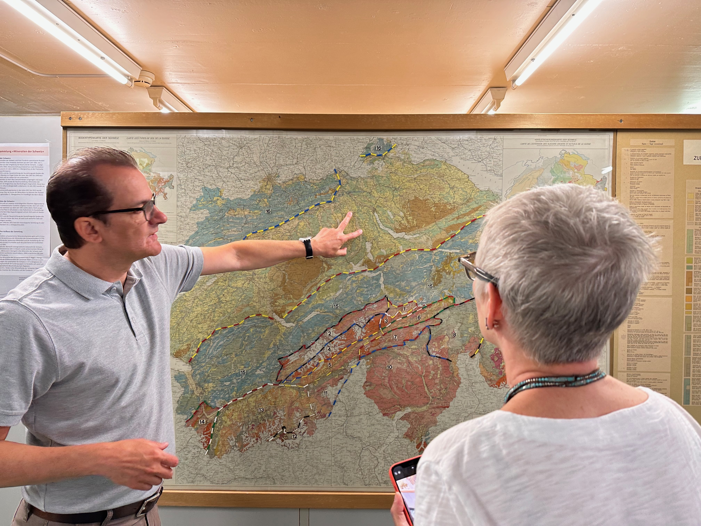
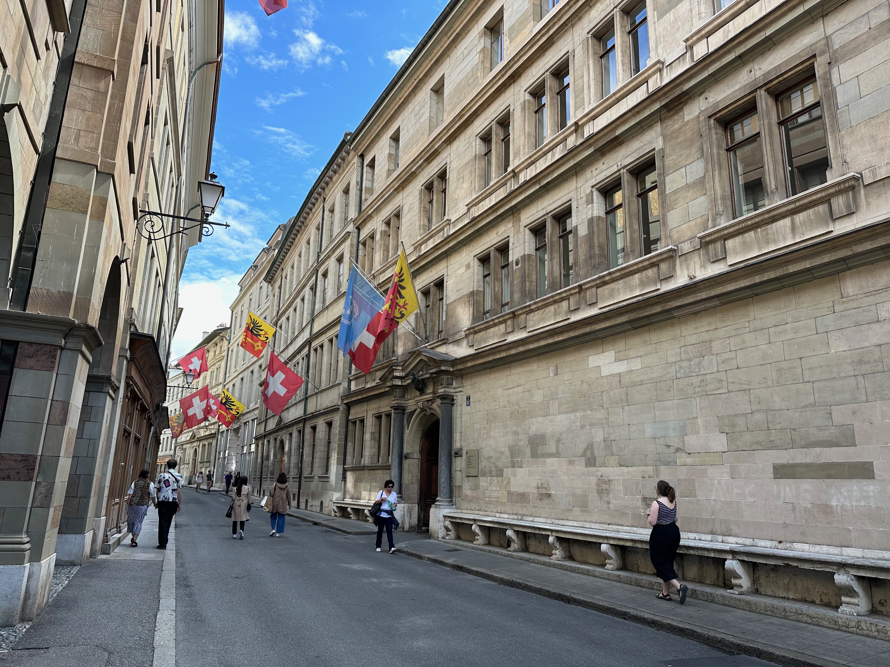
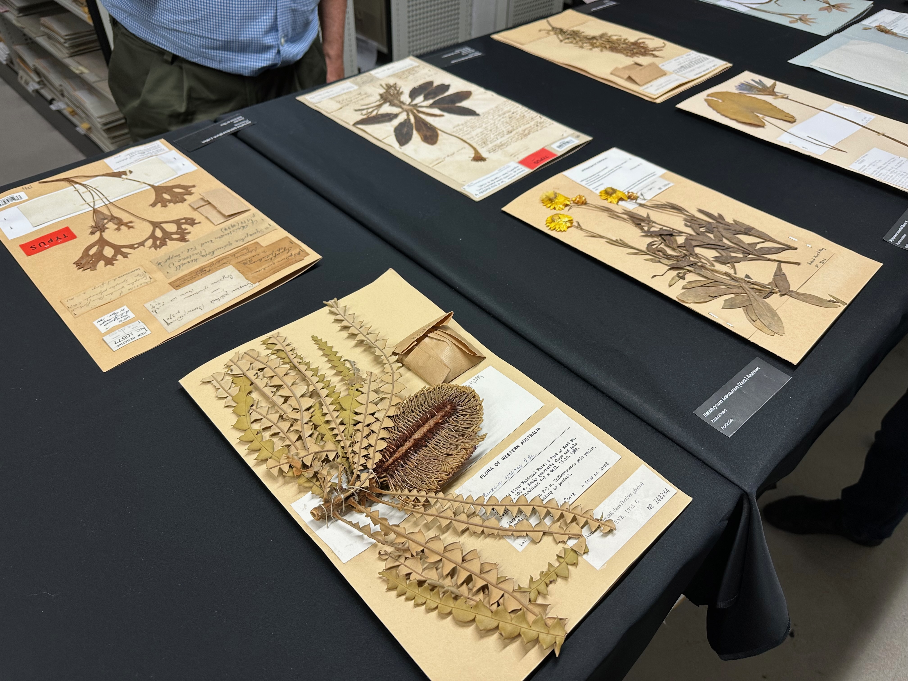
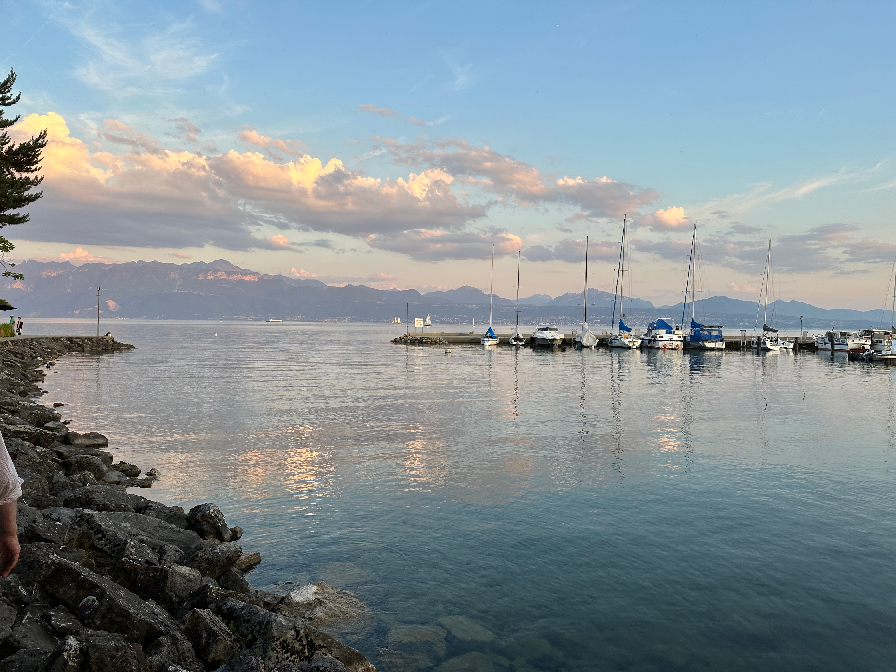
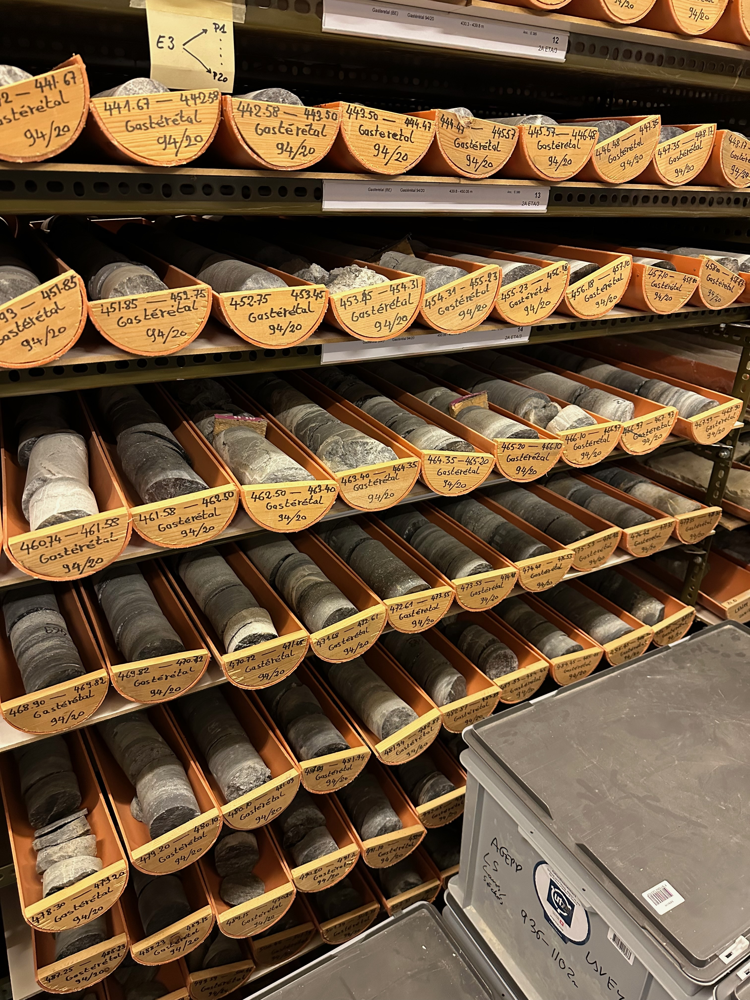
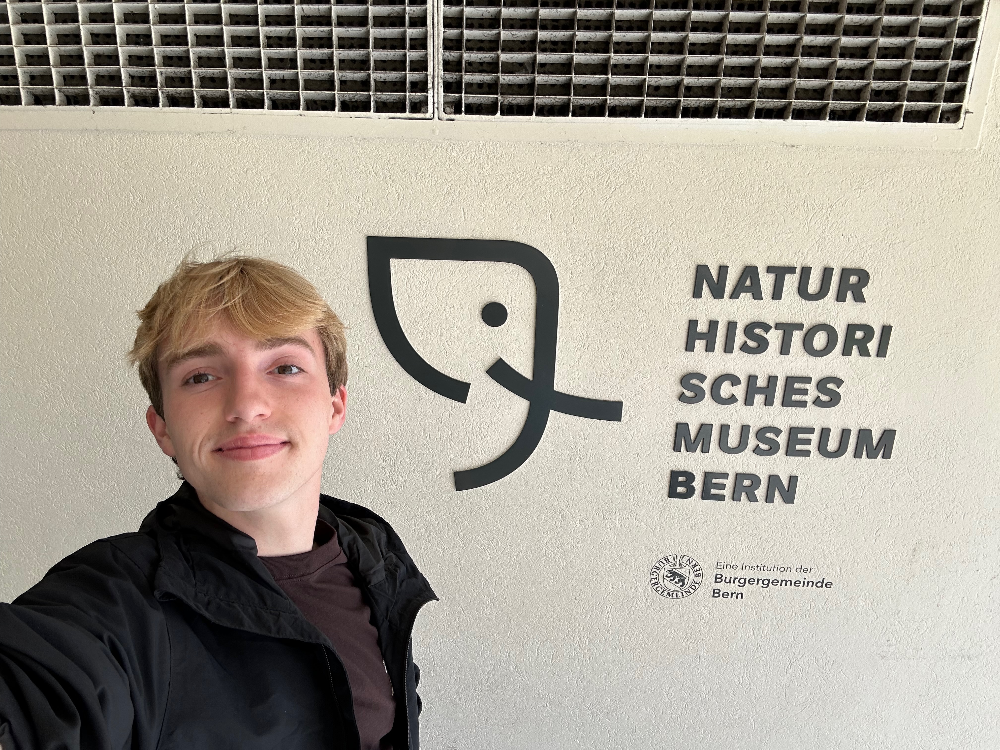

This past June, I had the incredible opportunity to visit several natural history museums in Switzerland as part of our development of the GeoSpecify platform (an extension of our software designed to support geoscience collections). This ongoing effort is funded by a grant from the Swiss Natural History Collections Network (SwissCollNet), a program of the Swiss Academy of Sciences.

Specify is a software program designed to help natural history and geoscience museums and research institutions manage their collections, and this trip provided a chance to see how different collections use and adapt Specify to meet their needs.

## Locations

<iframe src="https://www.google.com/maps/d/u/0/embed?mid=1ZykWkjf6ZLD2eE5kz0f-A9PA8c6iFSA&ehbc=2E312F&noprof=1" width="100%" height="480"></iframe>

We visited the following museums:

* Natural History Museum of Basel
* Natural History Museum of Bern
* Natural History Museum of Lausanne
* Natural History Museum of Geneva

While the specifics of each museum visit differed, a few common themes emerged. One of the most striking aspects was the sheer volume of specimens these institutions house. Millions of objects, from tiny fossils to massive rocks, are meticulously cataloged and stored. The dedication of museum staff to preserving specimens for modern research and future generations is truly inspiring, and this was my first time seeing geoscience collections in person.

Another interesting aspect of the trip was learning about the challenges museums face in managing their collections. I often hear about museums relying on aging database systems that are no longer efficient or user-friendly, and this was certainly the case to some extent with a few of our collaborators. In the geoscience collections space, we also found a noticeable lack of standardization in how data is collected and stored, making it difficult for museums to share information with one another. Biodiversity collections have primarily centered around Darwin Core[^1], but the same has not been seen in geology. Fortunately, this venture has helped us explore existing efforts to extend these standards for [Mineralogy and Geology](https://github.com/tdwg/efg).

These challenges highlight the importance of Specify and similar collection management software. We are not alone in providing museums with a centralized platform to catalog their collections, track loans, and generate reports. To be successful in our implementation, we must encourage some level of data standardization, making it easier for museums to collaborate.

## Major Takeaways

A few important points stood out to me during my visits:

* **The complexity of specimen data:** Museums collect a wide variety of information about each specimen, from its location and date of collection to its geological classification and chemical composition. GeoSpecify needs to be flexible enough to accommodate this complexity.
* **The importance of user-friendly interfaces:** Museum staff come from a variety of backgrounds, and the software they use needs to be easy to learn and operate. Specify's intuitive interface makes it accessible to both technical and non-technical users. Our webinars and documentation are important resources to help museums get started.
* **Offering choices for managing mineral names:** There are several authorities used by mineral collections, including Dana and Strunz. GeoSpecify must support either of these authorities, allowing museums to choose the one that best fits their needs.
* **Languages:** Many museums in Switzerland are multilingual (English, German, French, Italian, and Romansh[^3]), and Specify needs to support multiple languages. This is important for making Specify accessible to the widest possible audience.
* **The need for collaboration:** Museums can learn a lot from each other by sharing information and best practices. Specify's ability to facilitate data exchange can be a valuable tool for collaboration if we build it to be interoperable with other collection management systems. Leveraging systems like Darwin Core and others will be crucial for making this happen.

*[André Puschnig](https://www.nmbs.ch/en/museum/about-us/team/andre-puschnig.html) in Basel speaking to us about the geomorphology and lithological composition of the region.*

Overall, this trip was a valuable learning experience. It gave me a deeper appreciation for the challenges and rewards of museum work, and it showed me how Specify can play a role in helping museums preserve and share their collections for future generations.

## **Beyond the Science, There Were Some Lighter Moments as Well.**

* Learning about the different ways museums organize their collections. Some museums group specimens by type (minerals, fossils, rocks), while others organize them by geographical location. The lines are drawn very differently depending on historical practices and the types of collections housed.
* Discovering the fascinating stories behind some of the specimens. Mineral type specimens are carefully classified and named by mineralogists, and the story of how a mineral was first discovered or named can be just as interesting as the mineral itself. Because there are just over 6,000 recognized minerals[^2], it's not uncommon for a type specimen to have a very interesting story, and a significant portion of the world's type minerals were in these collections.

This trip was a reminder of the power of natural history and geoscience collections to spark curiosity and inspire wonder. I'm grateful for the opportunity to have been a part of it, and I look forward to seeing how Specify continues to evolve and meet the needs of research collections and museums in the future.

## Photos

*A historic street in Geneva.*

*Some lovely herbarium[^4] sheets in Geneva.*

*A gorgeous view of Lausanne around sunset with a view of the Alps.*

*Some impressive drill core specimens in Lausanne.*

*A photo of myself outside the Naturhistorisches Museum Bern.*

[^1]: DWC is a standard developed by [TDWG](https://dwc.tdwg.org/terms/) for sharing information about biological diversity. It provides a set of terms and definitions that facilitate the exchange of data about organisms and their occurrences.
[^2]: According to Mindat.org, there are currently [6,066 approved mineral species](https://www.mindat.org/minerals.php).
[^3]: [Romansh](https://en.wikipedia.org/wiki/Romansh_language) is a Romance language spoken in the Engadin Valley in Switzerland.
[^4]: A [herbarium](https://en.wikipedia.org/wiki/Herbarium) is a collection of preserved plant specimens and associated data used for scientific study.
