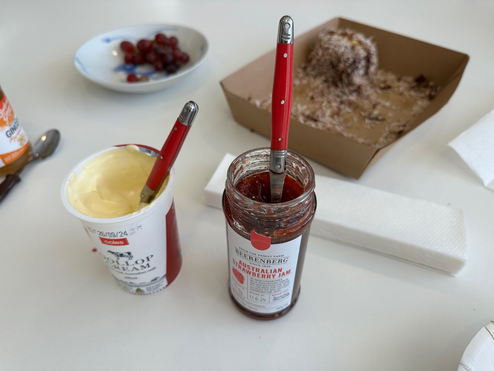

Last week, I had the amazing opportunity to work with current and prospective Specify users from around Australia at a workshop in the Western Australian Herbarium (DBCA). 

It was wonderful to meet many attendees for the first time and to connect in person with others after knowing them virtually for years.

*That's me speaking below, in case you were wondering!*

The workshop was hosted by the Western Australian Herbarium, part of the Department of Biodiversity, Conservation and Attractions (DBCA), and me. It focused on the deployment, configuration, and use of the Specify 7 platform. This two-day event centered on the installation and implementation of our data management system.

## Western Australian Herbarium

> Known by the internationally recognised Herbarium Code 'PERTH', the Western Australian Herbarium houses a collection of more than 845,000 dried specimens of plants, algae, bryophytes (mosses, liverworts and hornworts), lichens, fungi and slime moulds gathered from 1770 to today throughout Western Australia and from across the globe.

[You can learn more about PERTH and its research here](https://www.dbca.wa.gov.au/science/research-tools-and-repositories/western-australian-herbarium)

## Sessions

I had the pleasure of holding the welcome address and hosting a series of informative and interactive sessions about the history, configuration, and use of Specify software. The agenda featured topics ranging from data modeling and program interface navigation to query building and customizing the system. 

The participants took advantage of the networking opportunities during breaks, providing a valuable chance for individuals from different institutions to connect and share their knowledge and practices. On the second day, we explored advanced topics, including managing interactions like interinstitutional loans, gifts, and borrows, as well as exporting data. This culminated in a session on creating effective reports and labels for specimens and interactions.

When hosting workshops like this one, I often think of the reasons why institutions like the DBCA are interested in switching to our platform.

1. We develop and maintain a low-cost to free system that receives regular updates (and entirely [open source](https://github.com/specify/specify7)).
2. We provide support to entire natural history collections for as little as $1,000 a year[^2].
3. Our software has been around and in active development for over 35 years.

Considering that some workshop attendees are using [Texpress](https://emu.axiell.com/downloads/Texpress/user.pdf), a system that is over 20 years old and entirely terminal-based, this change is welcomed by most participants. Other attendees have varying levels of experience with the platform, making this an excellent opportunity to share new capabilities and address their questions.

Managing the expectations of users transitioning from custom solutions built by internal teams can be challenging. We provide software used by hundreds of collections worldwide. While specific functions, such as unique calculations or fully customized interfaces, may offer short-term benefits for a particular collection, the costs associated with an on-site staff member to develop and maintain this software can be substantial. We do our absolute best to accommodate all workflows, but these conversations are an omnipresent part of any workshop. 

Most sessions included live demonstrations of the software and open question-and-answer segments. Occasionally, breakout groups formed to discuss specific points or questions. It was extremely useful to speak with these small groups about how they envision organizing the data for their purposes and any concerns they have about the migration.

The event concluded with an interactive Q&A session that provided valuable insights and feedback, empowering attendees to enhance their data management practices. I am incredibly grateful for everyone who  participated in this workshop. As I mentioned during the meeting, I feel incredibly fortunate to assist collections staff in managing their data more effectively and contributing to biodiversity research.

## Slideshow

To start a workshop like this, I typically present a short (one-hour) overview of the topics we will cover. A PDF of this session is available for reference below:

<embed src="/src/assets/perth/Specify101.pdf" width="100%" height="500" />

This doesn't include the in-depth commentary that accompanies it, but if you're interested in hearing more you can always set up a [meeting with me](mailto:me@grantfitzsimmons.com) or another member of the Specify team!

## Miscellaneous

### Peacock Spider (*Maratus pavonis*)

After several discussions with one of the attendees, I was encouraged to search WA for a very specific species of jumping spider that is endemic to Australia. This species, *Maratus pavonis*, is known commonly as the "peacock spider" due to its vibrant colors and distinctive courtship display.

After several hours of searching in Kings Park[^3], I found one! Due to their size, which ranges from 2 to 6 mm[^4], my photos aren't as detailed as I'd like, but I was able to observe the courtship behavior and rapid movements. I reported the occurrence on iNaturalist[^5], which can be [seen here](https://www.inaturalist.org/observations/242303745).

### Herbarium

*Some beautiful art on the wall near the herbarium mounting room.*

*A historical specimen from a notable collector.*

*A look at the wonderful WA Reference Herbarium.*

From their [user guide](https://www.dbca.wa.gov.au/media/2418/download):
>The Western Australian Herbarium Reference Herbarium is a special-purpose, public access facility housing representative specimens of Western Australia’s native and naturalised species. It provides the most comprehensive reference collection for the identification of the State’s plants, a collection of library and electronic resources, and infrastructure to facilitate botanical study.

### Lamington

The team at the DBCA also surprised me with a Lamington[^1] along with other local candies, which was quite a delight. They taught me how to add the appropriate amount of jelly and cream (there's an order to this maddness!), and it was a lot of fun hearing from them about their favorite Australian desserts and candies. [Gummy snakes](https://aussiefoodexpress.com/products/natural-confectionery-snackes-200g?srsltid=AfmBOooEVi2uaxgd1Z8L_Sv-7_DDy9_ST5NUUeP1P6vQIw9k6WtS14Bx&variant=9000952954995) are a new favorite of mine (but you have to eat the head first).

[^1]: A [Lamington Cake](https://www.196flavors.com/australia-lamington/) is an Australian dessert made of sponge cake coated in chocolate and then covered in coconut.
[^2]: Our membership tiers and pricing structure can be [found on the Speciforum](https://discourse.specifysoftware.org/t/about-specify/943).
[^3]: Learn more about [Kings Park & Botanic Garden](https://www.bgpa.wa.gov.au/kings-park).
[^4]: [Girard, M. B., & Endler, J. A. Peacock spiders. Current Biology, 24(13)](https://www.cell.com/current-biology/pdf/S0960-9822%2814%2900591-0.pdf).
[^5]: [iNaturalist](https://www.inaturalist.org/home) is a citizen science platform and social network designed for nature enthusiasts, researchers, and anyone interested in biodiversity.
