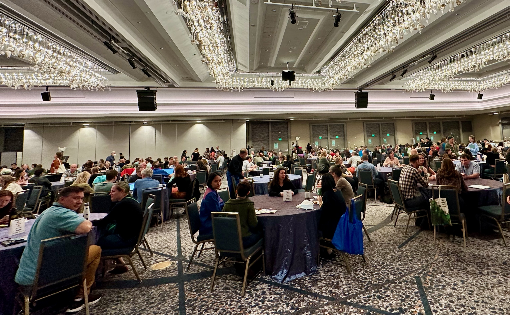
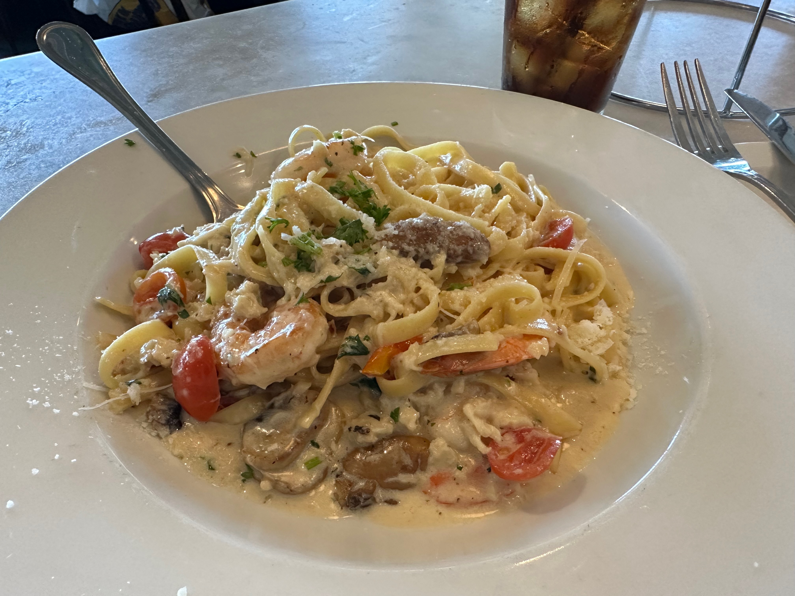
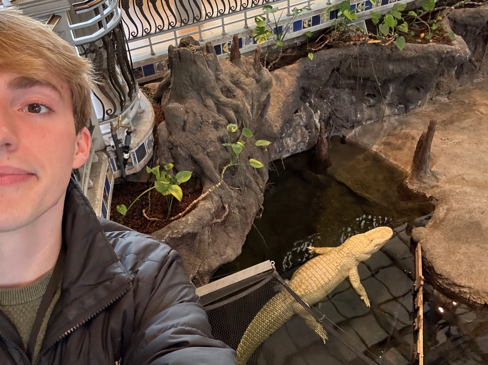
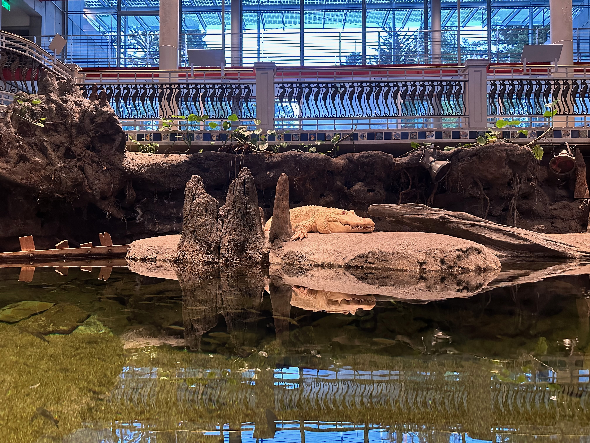
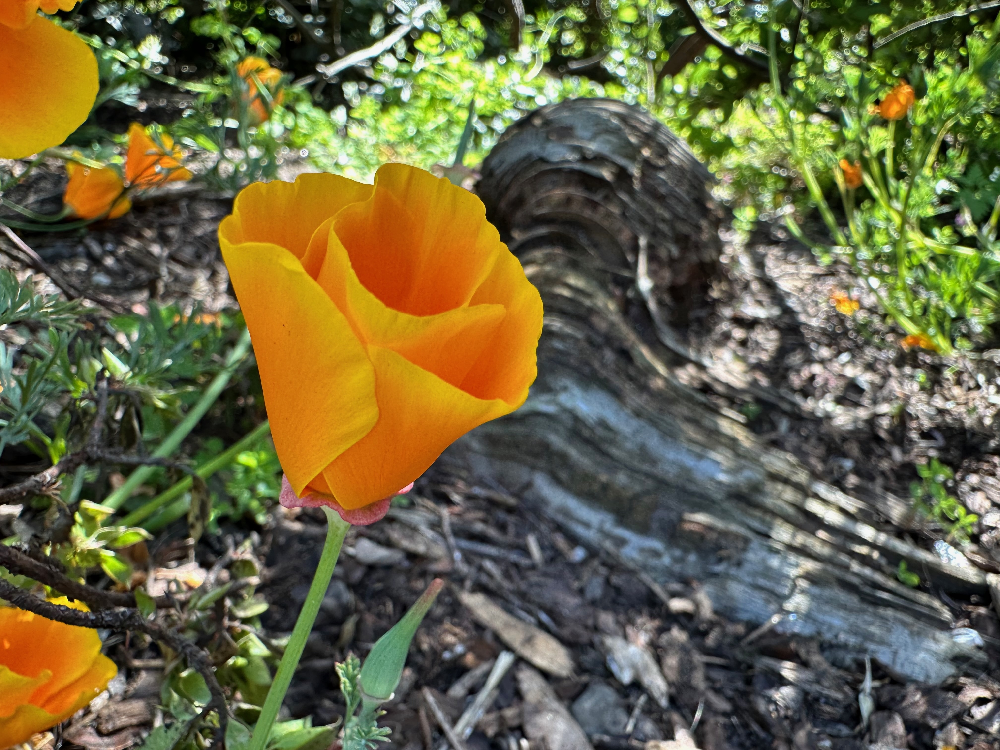
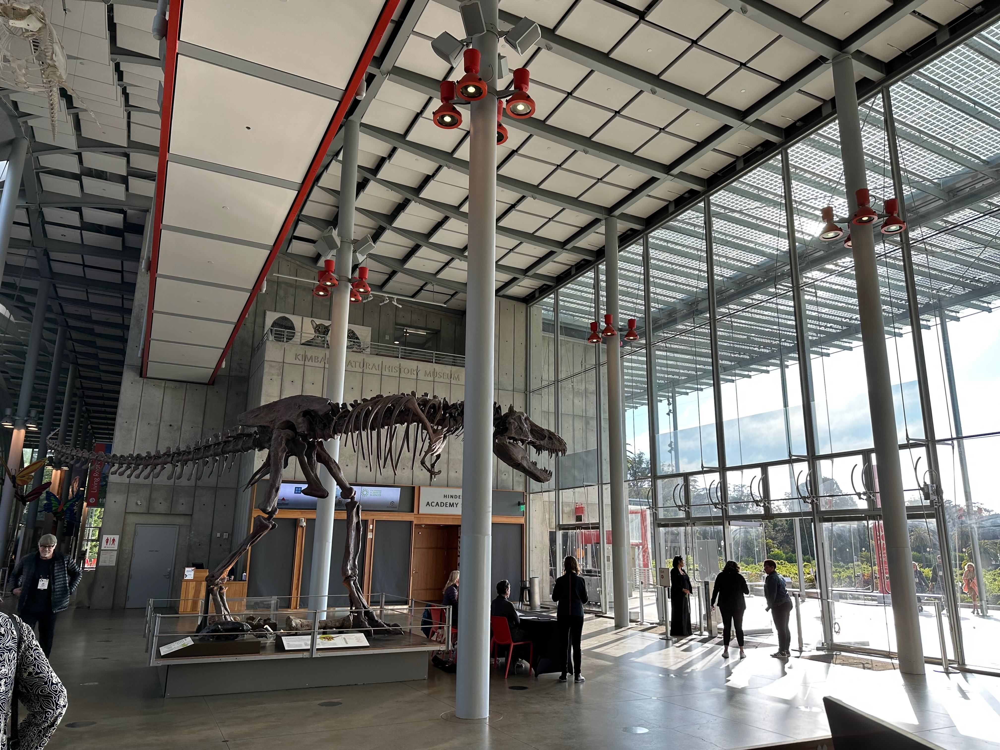

In late May 2023, I had the opportunity to travel to San Francisco, California, last May to attend my first SPNHC[^1] (often pronounced "spinach") conference. This meeting is exceptionally important for people in the biodiversity field, as it serves as a vital platform for software providers (such as the Specify group), researchers, and institutions to share their latest findings, innovations, and best practices in natural history collections and biodiversity conservation. For the work we do at Specify, this conference provides an invaluable opportunity for networking, giving us a platform to present our software, new developments, and create new relationships with prospective users and to reiterate our commitment to listening to our community for existing users. The workshops and presentations not only inspire new ideas but also equip attendees with practical knowledge that can be applied at their own institutions.

> The theme for 2023 was “Taking the Long View”, encouraging all of us to envision the future for our field, our collections, and ourselves. To kick off the week we have a trio of speakers who will be discussing the past, present and future of collections.

Discussions and talks covered topics ranging from specimen management and preservation techniques to the integration of technology in specimen management and research. These meetings often foster collaboration between museum curators, conservationists, and educators. The conference emphasizes the importance of monitoring biodiversity, including presentations on changes and discoveries in our ecosystems, and addresses the urgent need for preservation amid climate change and habitat loss.

*The Grand Ballroom with many of SPNHC attendees.*

<!-- This year, SPNHC held a joint conference with TDWG[^2], known as [SPNHC-TDWG 2024](https://spnhc.org/events/event/spnhc-tdwg-2024/), which took place at the Okinawa Convention Centre in Okinawa, Japan, from September 2 to 6. While it was a grueling flight, it was my first time traveling internationally for a conference and it was a great experience. -->

## My Session

### Advancing Biological Collections Computing with Specify 7: A Year of Transformational Updates

<iframe width="100%" height="410" src="https://www.youtube.com/embed/4fmZbbFjyhM?si=yjqWHGrq5dUGe-dR" title="YouTube video player" frameborder="0" allow="accelerometer; autoplay; clipboard-write; encrypted-media; gyroscope; picture-in-picture; web-share" referrerpolicy="strict-origin-when-cross-origin" allowfullscreen></iframe>

I gave a talk titled "Advancing Biological Collections Computing with Specify 7: A Year of Transformational Updates", alongside my colleague Theresa Miller. You can read the abstract below:

> The Specify Collections Consortium is enthused to announce that its flagship, open-source, collection management platform, Specify 7, is loaded with impressive new capabilities and a markedly heightened user experience.
>
> Of the hundreds of improvements to Specify 7 released in the last 12 months to the architecture, data operations, and user interface, some changes really stand out. We updated, streamlined, standardized, re-styled, and added capabilities to Specify’s overall design while significantly strengthening the application’s software infrastructure for accessibility and sustainability. We extended existing components and introduced new capabilities beyond the historical Specify 6 benchmark. Specify 7 now boasts a comprehensive, role-based, access and security system that makes creating and provisioning user accounts with fine-grained permissions efficient and scalable. Added to support for single sign-on (SSO, SAML2 and OpenID endpoints), Specify 7 takes collections data security to a higher level.
>
> We enhanced the intelligence of Specify’s data forms behavior and validations to help ensure accurate data entry. We delivered a new and powerful “Meta Menu”, instantly accessible from any data form, with functions for running reports/labels, configuring Carry Forward, auto-numbering, inspecting edit history, ordering results, switching subviews display formats, form definition editing, and URL link sharing. We also improved the functionality of Specify’s tree interface, the WorkBench, the Query Builder, and system configuration tools for editing App Resources.
>
> Additional improvements that make a difference include: better browser page navigation (now each Specify page has a unique URL for easier navigation and reference), user preference synchronization between browser tabs, a new interface for the Darwin Core Archive exporting tool, and for fun, we activated shortcut queries to Collection Object records associated with the taxa displayed in the Taxon Tiles splash screen. We integrated Weblate, a continuous localization service for crowdsourcing the translation of Specify 7, opening the door for operating Specify in dozens of new languages.
>
> Several huge new capabilities in Specify 7 will be released by the SPNHC 2023 meeting, including record deduplication and merging; a configurable statistics panel for defining and customizing statistical summaries of your collection; and Specify Network links to community data providers. We will have integrations of the Extended Specimen concepts and the Fair Digital Object Architecture. All of these technologies and hundreds of user-reported engineering fixes will increase your productivity with collections data computing including the publication of your records to the broader biodiversity data community.
>
> This presentation and accompanying DemoCamp demonstration will highlight many of these empowering, new capabilities and showcase the wealth of capabilities Specify offers for effective collections data curation, management, and integration.

After the talk, the reception was overwhelmingly positive. Attendees expressed excitement about the new capabilities, particularly the role-based access system and improved data entry features. Many appreciated the emphasis on accessibility and sustainability, as well as the potential for broader community engagement through new integrations. Overall, the feedback reinforced our belief that Specify 7 is a valuable tool for advancing biological collections computing.

Theresa gave a live demo of unreleased (and admittedly untested) features, which was a hit with the audience. The demo showcased the new Meta Menu, record deduplication and merging, and the configurable statistics panel, among other features. Attendees were impressed by the intuitive design and functionality of the new tools, and many expressed interest in implementing them at their own institutions.

## Travel

The highlight of my trip is still the time I spent at the California Academy of Sciences, which is home to an incredible aquarium, planetarium, and incredibly engaging natural history collections space. The museum's living roof is a marvel of sustainable architecture, and the exhibits are both educational and engaging.

I also had the chance to visit the surrounding Golden Gate Park, which in addition to housing the California Academy of Sciences, also hosts the de Young Museum and a Japanese Tea Garden. The park is a beautiful oasis in the middle of the city, with lush gardens, walking paths, and plenty of open space to relax and enjoy the outdoors. It was quite a juxtaposition to the busy city streets surrounding it and a welcome respite.

I had the wonderful opportunity to explore San Francisco and the surrounding area. The city is known for its iconic landmarks, including the Golden Gate Bridge, Alcatraz Island, and Fisherman's Wharf– all of which I had the chance to observe during my time there. The city's diverse neighborhoods, from the historic Mission District to Haight-Ashbury, offer a glimpse into the city's rich culture and vibrant arts scene. I also loved the city's culinary scene, which I had the chance to explore on Pier 39 and in the Mission District.

*The iconic golden gate bridge.*

We dined at Crab House at Pier 39, a fantastic seafood restaurant with a view of the bay. I had the opportunity to try the crab and shrimp pasta, which was excellent, especially since I usually don't have access to such fresh seafood in Kansas. The food was delicious, and the atmosphere was lively and fun. We also had the chance to try some local favorites, including fresh seafood from the Fisherman's Wharf area.

It was also great to see the sea lions lounging on the docks at the pier. I could have watched them for hours and this is something I recommend any visitor to San Francisco to check out.

*Claude[^3], the albino alligator, basking and swimming at the California Academy of Sciences. One of only a couple albino alligators in the entire world*

## Miscellaneous Photos

*Francisco Street.*

*Beautiful California poppy (Eschscholzia californica)[^2] at the California Academy of Sciences.*

*A beautiful dinosaur skeleton displayed at the reception area of Cal Academy.*

[^1]: The Society for the Preservation of Natural History Collections (SPNHC) is an international organization devoted to the preservation, conservation, and management of natural history collections.

[^2]: [See this occurrence on my iNaturalist (Jun 2, 2023 · 10:40 AM)](https://www.inaturalist.org/observations/257487259).

[^3]: Claude is an albino American alligator, born in 1995, who has lived at the California Academy of Sciences since 2008. He is one of the most popular attractions at the museum and you can [learn more about him here](https://www.calacademy.org/exhibits/the-swamp).
