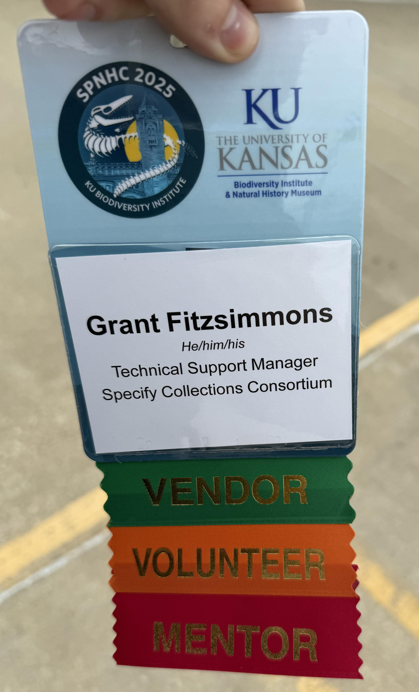

import { YouTube } from 'astro-embed';

This year, for the first time in the history of the SPNHC conference (often pronounced "spinach"), the University of Kansas (KU) hosted the event in Lawrence, Kansas, USA. My close colleague and Specify Usability Consultant, [Andy Bentley](https://orcid.org/0000-0002-3093-1258), coordinated the effort to bring the conference to our campus. He led the local organizing committee, which included many staff members from the KU Natural History Museum & Biodiversity Institute. They did an amazing job organizing the event. This was the best-organized SPNHC conference I have attended, and I am very grateful for all their hard work.

The Specify Collections Consortium (SCC) has been a long-time supporter of SPNHC, and this year we were able to host the conference in our own backyard. This was a great opportunity for us to connect with current and prospective Specify users, as well as to share our latest developments. To take full advantage of this opportunity, we organized two symposia, one on data publishing and the other on spotlighting Specify users. We also organized and hosted a 2-day workshop on Specify 7, which was attended by over 30 people.

I could not have done it without [Theresa Miller](https://biodiversity.ku.edu/people/theresa-miller), who went above and beyond in organizing our presence at the conference. She wrote abstracts, prepared and presented a demo, and managed every detail of our workshop and table.

## Social Events

### Collection Tours

During the museum's "Collection Tours," we hosted our own "Specify Tour," inviting friends of the project to explore our office space. While it may have seemed a bit silly compared to the other tours highlighting the amazing and rich natural history collections at KU (think ichthyology, herpetology, paleontology, and more), it was a fun chance to showcase our eclectic cubicles. There were some photos taken of my cube.

### Specify Soirée
There was a private event held for members and supporters of the SCC and our mission, which proved to be a great chance to discuss possible new collaborations with other institutions. There were talks about organizing a trip for me or one of my colleagues to visit some of these institutions to drum up support and interest in Specify. I’m excited to see where these conversations lead!

It was great to chat with other members in the Collections Management Software community, including the wonderful [Deb Paul](https://orcid.org/0000-0003-2639-7520), the Biodiversity Informatics Community Manager at Species File Group.

### Banquet

I had a great time at the SPNHC banquet, where we had local Kansas BBQ, wonderful conversations, and a great time dancing. I had some time to chat with KU collections staff which is always a pleasure, and I was able to meet some wonderful new people as well.

## 2-Day Workshop

By far the most challenging and engaging part of the conference was the two-day workshop we had organized, “Maximizing Your Specify Instance.” We had designed this workshop for current Specify users already familiar with the software’s basics, but in reality, we attracted a diverse group of participants with varying levels of expertise. It had taken many days of planning and preparation, and I am so grateful to [Theresa Miller](https://biodiversity.ku.edu/people/theresa-miller) and Jason Melton for their hard work in organizing the workshop and handling the logistics.

This was only the third in-person workshop I had hosted since I began my role in 2023, and I believe it was the best one yet. We had a great turnout, with over 30 participants from around the world—including Denmark, Canada, Switzerland, Spain, Sweden, and many from the United States. It was a wonderful opportunity to connect in person with people I’d supported virtually over the years but had never met face to face. The workshop was a great success, and we received a lot of positive feedback from the attendees.

### WKSH09 – Maximizing Your Specify Instance

**Organizers:** Theresa Miller, Grant Fitzsimmons (Specify Collections Consortium)
**Speakers:** Grant Fitzsimmons, Theresa Miller, Jason Melton

**Dates:** May 31–June 1, 2025
**Length:** Two days

{/* <embed src="/spnhc2025/workshopAgenda.pdf" width="100%" height="500" /> */}

**Abstract:**  
Specify is excited to offer a two-day workshop for our users as part of the SPNHC 2025 meeting. Specify is an extremely robust and adaptable system, enabling users to customize workflows to their collection’s needs. However, with great adaptability comes great complexity. This workshop is intended for current Specify users already familiar with the basics (database schema, setup options, basic data entry and querying).  
-  **Day 1 (Intermediate):** Customizing forms, refining workflows, using the Batch Edit tool, and setting up export mappings.  
-  **Day 2 (Advanced):** Workbench bulk uploads, Darwin Core Archive publishing, API integrations, and troubleshooting tips.  

Participants will leave with hands-on experience and best practices for leveraging their Specify instance to its fullest potential.

## Symposia

### SYM08 – Things to Know Before Publishing Your Data

In this symposium, we explored best practices, standards, and tools for publishing specimen data to global aggregators.
We had a great lineup of speakers from major biodiversity data aggregators and institutions, including GBIF, ALA, iDigBio, and Symbiota.

> **Publishing Your Data with Specify 7**  
> Grant Fitzsimmons, Theresa Miller  
> Specify Collections Consortium, Lawrence, KS, USA  
>
> The Specify Collections Consortium (SCC) supports research collections around the world with an intuitive, robust, and highly-customizable software platform for digitizing their holdings and managing their collections. For over 25 years, the SCC has supported biological research museums, biorepositories, and now geological research museums, with its open-source Specify software for managing, integrating, and publishing collections information.
>
> Data publishing is critically important to collection managers and is a continuously evolving requirement. The SCC has prioritized improving the Specify data export/publication process in 2025 by facilitating publishing to data aggregators such as the Global Biodiversity Information Facility (GBIF), the Atlas of Living Australia (ALA), the Global Genome Biodiversity Network (GGBN), and Integrated Digitized Biocollections (iDigBio). Publication focuses on the Darwin Core standard and its extensions as defined and maintained by Biodiversity Information Standard’s (TDWG) Darwin Core maintenance group. Specify users can take advantage of direct RSS feed publishing to these data aggregators as well as on-demand export creation.
>
> This presentation will present upcoming changes to Specify 7’s data exporting functionality and describe how Specify users can utilize new changes to set up one or more export mappings, incorporate limiting criteria, and publish their data in Darwin Core Archive (DwCA) format or other publishing formats.

<YouTube id="9IRK803yAHE" params="start=6362"/>

| Session ID | Time        | Title                                                                                          | Presenters                                                                                   | Institution                                                                                               |
|------------|-------------|------------------------------------------------------------------------------------------------|----------------------------------------------------------------------------------------------|-----------------------------------------------------------------------------------------------------------|
| 172        | 08:30–08:45 | You put what, where?! Challenges, changes and the here and now of the Darwin Core Standard      | David Bloom                                                                                  | University of North Carolina Greensboro; TDWG, San Francisco                                              |
| 51         | 08:45–09:00 | Best practices for publishing useful and high quality specimen datasets to GBIF                 | John Waller                                                                                  | GBIF, Copenhagen, Denmark                                                                                 |
| 187        | 09:00–09:15 | Advancing Specimen Data Publishing through Digital Specimen Infrastructure                      | Wouter Addink; Soulaine Theocharides; Sharif Islam; Ni Yan                                  | Naturalis, Leiden, Netherlands                                                                             |
| 238        | 09:15–09:30 | Push or pull, give and take: History of working with technically diverse data providers in ALA | Peggy Newman¹; Patricia Koh²; Mahmoud Sadeghi²; Niels Klazenga³; Rosemary O'Connor⁴; Pruthviraj Chavan⁵; Simon Sherrin¹ | ¹Atlas of Living Australia, Melbourne; ²ALA, Canberra; ³RBG Victoria, Melbourne; ⁴ALA, Brisbane; ⁵ALA, Melbourne |
| 217        | 09:30–09:45 | Exploring common questions to iDigBio related to data mobilization                              | Kalina Jakymec¹; Caitlin Chapman²; Austin Mast¹³                                           | ¹Florida State University, Tallahassee; ²Florida Museum of Natural History, Gainesville; ³FSU, Tallahassee |
| 5          | 09:45–10:00 | Preparing & Publishing Museum Specimen Data: a Graduate Student's Journey                       | Lily Hart¹; R. Edward DeWalt²                                                               | ¹University of Illinois, Champaign; ²Illinois Natural History Survey, Champaign                            |
| 82         | 10:00–10:15 | How the Symbiota Support Hub can help publish your extended specimen data                       | Lindsay Walker¹; Edward Gilbert¹²; Mark Fisher¹; K. Samanta Orellana¹; Katie Pearson¹; Gregory Post¹; Nikita Salikov¹; Logan Wilt¹; Jenn Yost³; Nico Franz¹ | ¹University of Kansas, Lawrence; ²Arizona State University, Tempe; ³Cal Poly San Luis Obispo               |
| 46         | 10:15–10:30 | Publishing Your Data with Specify 7                                                             | Grant Fitzsimmons; Theresa Miller                                                           | Specify Collections Consortium, Lawrence, KS                                                              |

---

### SYM07 – Specify Spotlight: Improving Data Digitization and Management

This session showcased Specify users’ projects and featured an overview of Specify 7’s latest features and upcoming developments.

> **COGs, COTs, and Other Interesting Acronyms in Specify 7**  
> Grant Fitzsimmons, Theresa Miller  
> Specify Collections Consortium, Lawrence, KS, USA  
>
> *Abstract:* A live demonstration of new features in Specify 7, including the Batch Edit tool for bulk editing existing records and the Workbench for bulk uploading new identifications, citations, tissue data, and soon, images. Learn how these enhancements streamline digitization and data integrity workflows.

<YouTube id="DKDDrApOZY0" params="start=4585" />

| Session ID | Time        | Title                                                                                                           | Presenters                                                                                       | Institution                                                                                     |
|------------|-------------|-----------------------------------------------------------------------------------------------------------------|--------------------------------------------------------------------------------------------------|-------------------------------------------------------------------------------------------------|
| 102        | 08:30–08:45 | Navigating Complexities: Implementing Specify 7 at the Canadian Forest Service                                 | Kathryn Jastremski; Jonathan Tardif; Heryk Julien; Amelie Potvin                                | Canadian Forest Service, Laurentian Forestry Centre, Quebec, Canada                             |
| 113        | 08:45–09:00 | Integrating Specify 7 into a National Mass Digitization Infrastructure                                          | Fedor Steeman                                                                                   | Statens Naturhistoriske Museum, Copenhagen, Denmark                                             |
| 146        | 09:00–09:15 | Integrating Specify into an efficient workflow for managing the sampling of herbarium specimens at RBGE        | Robyn Drinkwater; Robert Cubey; Elspeth Haston                                                  | Royal Botanic Garden Edinburgh, United Kingdom                                                 |
| 85         | 09:15–09:30 | Adding Value: Semi-Automated Label Transcription at the Museum für Naturkunde Berlin                            | Franziska Schuster; Stefanie Krause; Christian Bölling; Margot Belot; Leonardo Preuss            | Museum für Naturkunde – Leibniz Institute for Evolution and Biodiversity Research, Berlin, Germany |
| 221        | 09:30–09:45 | Data Management at the University of Kansas Invertebrate Paleontology Collection (KUMIP) Using Specify          | Natalia López Carranza                                                                          | Biodiversity Institute, University of Kansas, Lawrence, KS, USA                                |
| 47         | 09:45–10:00 | COGs, COTs, and Other Interesting Acronyms in Specify 7                                                        | Grant Fitzsimmons; Theresa Miller                                                               | Specify Collections Consortium, Lawrence, KS                                                   |
| 10         | 10:00–10:30 | Discussion                                                                                                      | —                                                                                                | —                                                                                               |

I’m grateful to all presenters and attendees for making SPNHC 2025 a success. Thank you for taking the time to read this post, and please [send me an email](mailto:me@grantfitzsimmons.com) if you have any questions!

*This year, I was a mentor, volunteer, and vendor all at once.*

---

[^1]: The Society for the Preservation of Natural History Collections (SPNHC) is an international organization devoted to the preservation, conservation, and management of natural history collections.