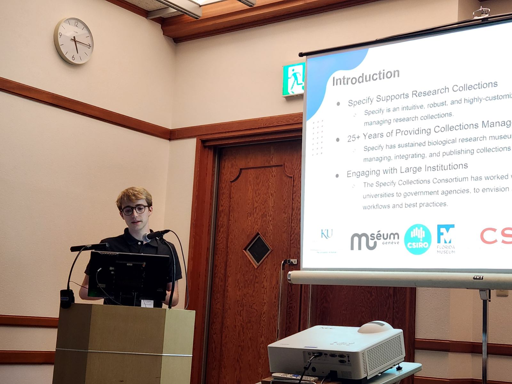

I had the opportunity to travel to San Francisco, California, last May to attend my first SPNHC[^1] (often pronounced "spinach") conference. This meeting is exceptionally important for people in the biodiversity field, as it serves as a vital platform for software providers (such as the Specify group), researchers, and institutions to share their latest findings, innovations, and best practices in natural history collections and biodiversity conservation.

Discussions and talks covered topics ranging from specimen management and preservation techniques to the integration of technology in specimen management and research. These meetings often foster collaboration between museum curators, conservationists, and educators. The conference emphasizes the importance of monitoring biodiversity, including presentations on changes and discoveries in our ecosystems, and addresses the urgent need for preservation amid climate change and habitat loss.


For our team, the SPNHC conference provides an invaluable opportunity for networking, allowing us to forge connections with prospective and current Specify users that can lead to future collaborations and data conversions. The workshops and presentations not only inspire new ideas but also equip attendees with practical knowledge that can be applied at their own institutions.

This year, SPNHC held a joint conference with TDWG[^2], known as [SPNHC-TDWG 2024](https://spnhc.org/events/event/spnhc-tdwg-2024/), which took place at the Okinawa Convention Centre in Okinawa, Japan, from September 2 to 6. While it was a grueling flight, it was my first time traveling internationally for a conference and it was a great experience. 


## My Sessions

### Digitization Planning

I presented a talk titled "Digitization Planning for Large Collections with Specify 7" (https://doi.org/10.3897/biss.8.133987). 



*Not many images of me speaking to choose from, but this should give you an idea of the setup.*

<embed src="/src/assets/spnhctdwg2024/largecollections.pdf" width="100%" height="500" />


In my presentation, I discussed how the Specify Collections Consortium (SCC) has supported research collections worldwide for over 35 years through its intuitive and customizable software platform. I shared insights from our collaborations with universities and federal agencies, focusing on the development of frameworks to standardize workflows for managing large collections. 

I addressed common hurdles in data preparation, such as unstandardized formats and unparsed taxonomy, and shared strategies to overcome these issues. I  explored the complexities of data sharing between collections, discussing how to balance centralized coordination with individual collection needs. 

***Tip:** When parsing data, use [OpenRefine](http://openrefine.org) and [regular expressions](https://developer.mozilla.org/en-US/docs/Web/JavaScript/Guide/Regular_expressions)!*

I emphasized the importance of effective communication and collaboration among staff and volunteers during the transition to a new collections management system. Drawing on our extensive institutional experience, I provided a framework to help organizations navigate the challenges of implementing a collections management system, ultimately aiming to enhance the preservation and accessibility of natural history collections worldwide, with support for geoscience collections coming in the near future.

```
Biodiversity Information Science and Standards  
2024-08-07 | Journal article  
DOI: 10.3897/biss.8.133987  
Part of ISSN: 2535-0897  
Contributors: Grant Fitzsimmons; Theresa Miller  
```

### Specify Spotlight: Enhancing biodiversity data management

I also had the chance to host a symposium featuring several Specify users who discussed their support for and use of Specify software! This took several months of planning and extensive communication with the participants that would not have been possible without my co-organizer Theresa Miller. These sessions were enormously successful and we filled the room in which the symposium was hosted. 

| Session ID | Time  | Title                                                                                      | Presenters                                                        | Institution                                                            |
|------------|-------|--------------------------------------------------------------------------------------------|-------------------------------------------------------------------|------------------------------------------------------------------------|
| 109        | 19:00 | Enhancing Enterprise Collection Management: A Case Study of CSIRO's National History Collections | Corinna Paeper, Peter H. Thrall, Dan Baker, Zoe Warner          | Commonwealth Scientific and Industrial Research Organisation (CSIRO), Canberra, ACT, Australia |
| 112        | 19:15 | Administering an Enterprise Collection Management System: Specify in practice at CSIRO's National History Collections | Zoe Warner, Peter H. Thrall, Corinna Paeper, Dan Baker          | Commonwealth Scientific and Industrial Research Organisation (CSIRO), Canberra, ACT, Australia |
| 177        | 19:30 | Using Collections in Specify to manage incoming exchange data                              | Alison Vaughan, Niels Klazenga                                   | Royal Botanic Gardens Victoria, Melbourne, Victoria, Australia          |
| 218        | 19:45 | Using Specify 7 as a Collections Management System for the Royal Botanic Garden Edinburgh herbarium | Robyn Drinkwater, Elspeth Haston, Robert Cubey                  | Royal Botanic Garden Edinburgh, Edinburgh, United Kingdom              |
| 210        | 20:00 | Using Specify 6, 7 and Web Portal instruments for the North Siberian Biodiversity Data Platform | Nina Filippova                                                  | Yugra State University, Khanty-Mansiysk, Khanty-Mansi Autonomous Okrug, Russian Federation |
| 332        | 20:15 | Extending Specify 7 for Geoscience Collections                                             | Theresa Miller, Grant Fitzsimmons                                | Specify Collections Consortium, Lawrence, KS, USA                      |

All speakers were physically present at the conference aside from Nina Filippova who presented remotely (in the middle of the night) from Russia! I'm so grateful for their presentations and I look forward to sharing the recordings as soon as they are publicly available.


[^1]: The Society for the Preservation of Natural History Collections (SPNHC) is an international organization devoted to the preservation, conservation, and management of natural history collections.

[^2]: Biodiversity Information Standards (TDWG), pronounced "tad-wig," develops and maintains data standards that support the integration of primary biodiversity information across disciplines, organizations, and nations. Its annual conference has become a preeminent forum for advancing biodiversity informatics.