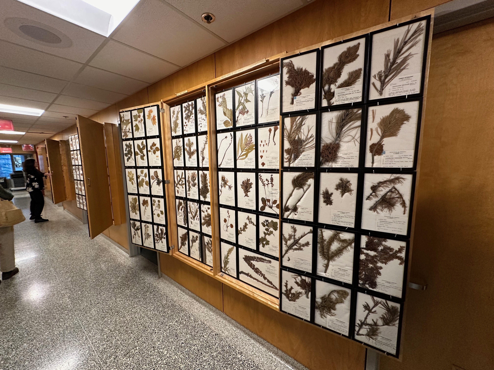
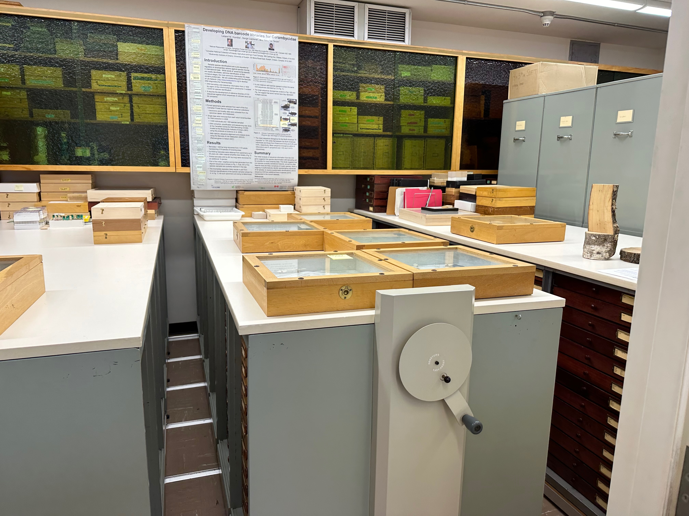
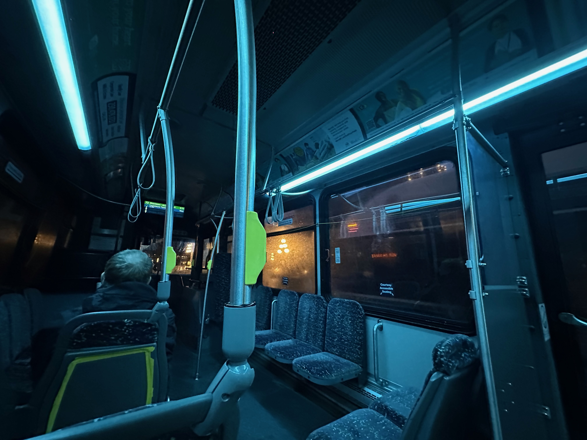
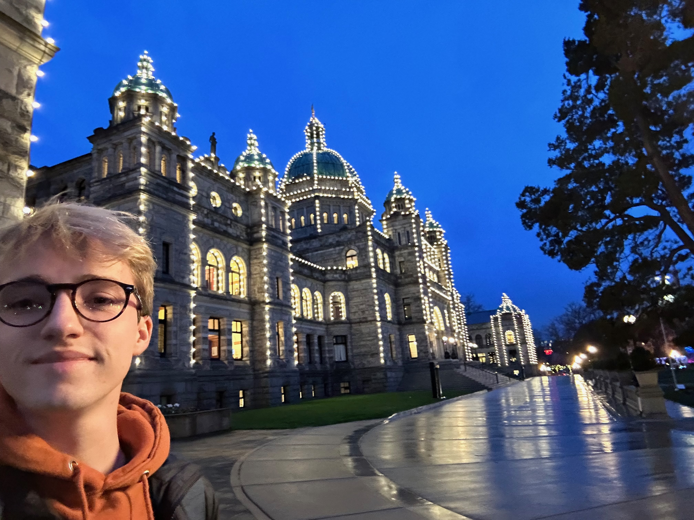
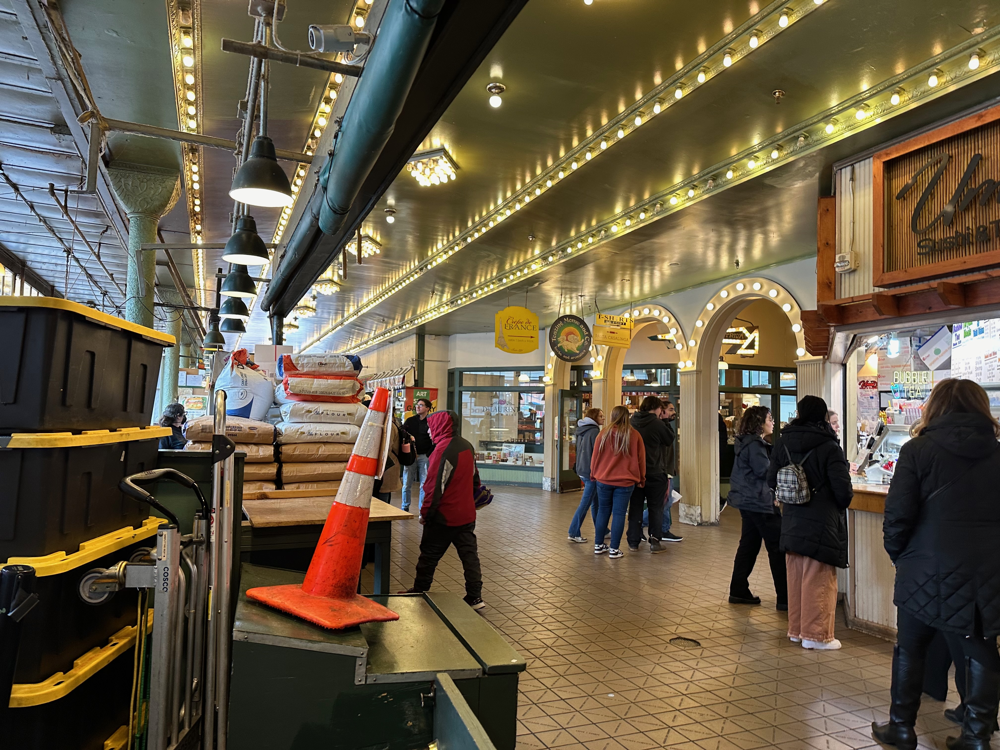
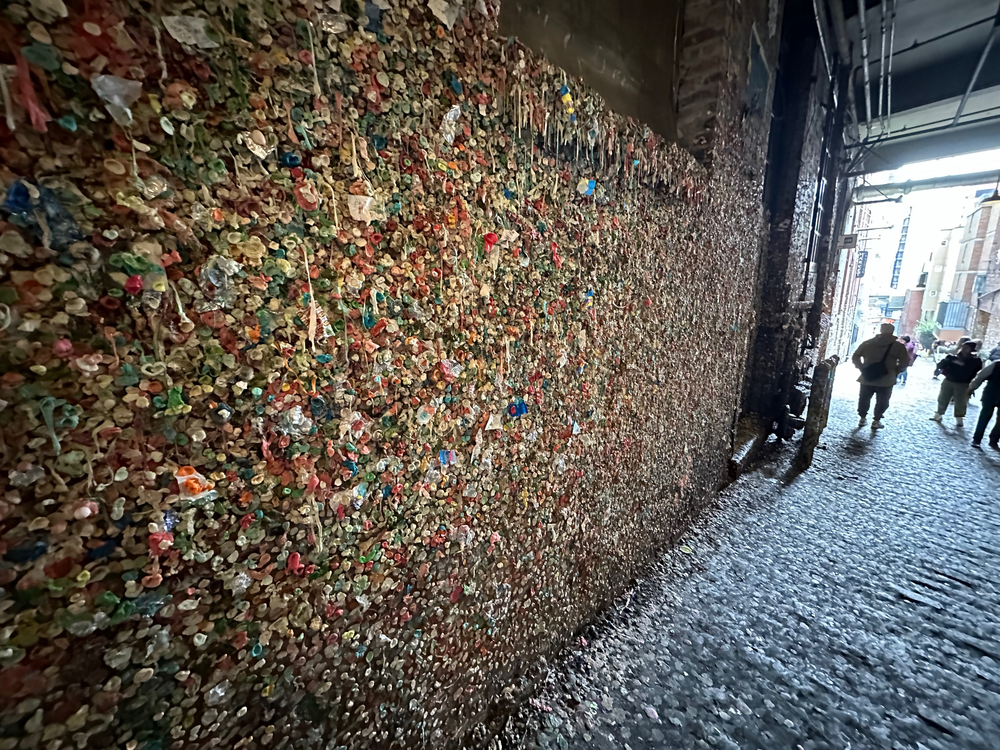
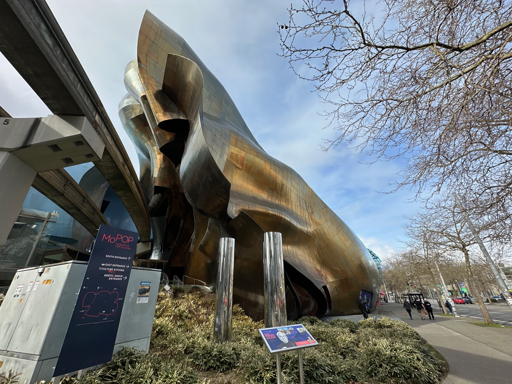

Last week, I had the fantastic opportunity to connect with collection managers and staff from the Canadian Forest Service at the CFS Collections Workshop held at the Pacific Forestry Centre in the gorgeous city of Victoria, British Columbia.

It was such a joy to meet many of the attendees for the first time and to finally put faces to names after years of virtual chats!

*That’s me leading a session below—just in case you were wondering!*

The workshop was organized by the Canadian Forest Service (CFS) and the Natural Resources Canada (NRCan) Scientific Collections Project team. Our goal was to dive into the implementation of Specify software as a national collection management tool for CFS collections. We had nearly 30 participants join us, both in person and online, representing all sorts of roles in managing scientific collections.

# Pacific Forestry Centre

> The Pacific Forestry Centre is a hub for forest research and development, dedicated to sustainable forest management. It’s a key facility for the Canadian Forest Service, contributing to the understanding and preservation of Canada’s diverse forest ecosystems.

[You can learn more about the Pacific Forestry Centre here](https://www.nrcan.gc.ca/forests).

# Workshop Sessions

I was thrilled to lead two sessions on the first day of the workshop:

1. **Specify 101 for Curators and Collections Managers**
   In this session, we explored the basics of the Specify platform, including a live demo that showcased its features. The participants were eager to learn how Specify can streamline their collection management processes.

2. **Specify-7 In-Depth**
   We then dove deeper into data preparation and taxonomy, arming everyone with the knowledge they need to hit the ground running when they make the switch to Specify or further their use of the platform.

After lunch, we had a breakout session where participants grouped by the type of collection they manage. This was a fantastic opportunity for everyone to discuss specific issues and share their best practices in a collaborative setting.

# Slideshow

To kick off the workshop, I presented a brief overview of the topics we would cover. A PDF of this session is available for reference below:

<embed src="/victoria/CFS_Workshop_Overview.pdf" width="100%" height="500" />

If you’re curious to learn more or have any questions, don’t hesitate to reach out to me at [my email](mailto:me@grantfitzsimmons.com)!

Throughout the sessions, I encouraged open dialogue, and the Q&A segments were a hit! It was so inspiring to see the enthusiasm from the participants as they engaged with the material and each other, sharing insights and experiences related to their unique collections.

## Herbarium Displays

One of the highlights was seeing the beautiful herbarium sheets mounted for display at the forestry center. 

Additionally, I had the chance to check out their working collection for insects, which was impressive. I also learned about their work developing DNA libraries for Cerambycidae, which you can explore more about through the [GBIF taxonomy](https://www.gbif.org).

# Networking and Community Building

One of the best parts of the workshop was the chance to network. After a productive day, we headed downtown to Swans Pub for dinner, where the conversations continued in a more relaxed atmosphere. It was a great way to foster connections and build a sense of community among collection managers and staff.

The feedback from attendees was overwhelmingly positive, with many expressing excitement about transitioning to Specify and relief at moving away from outdated systems. It’s clear that everyone is eager to embrace the efficiencies that Specify offers!

# Conclusion

I’m incredibly grateful for the warm welcome from the CFS team and the chance to contribute to enhancing collection management practices in Canada. The dedication of the participants to improving their data management capabilities is truly commendable, and I can’t wait to see how Specify empowers their work moving forward.

## Miscellaneous

I only had a short time to explore Victoria, so I ventured out to visit the Legislative Assembly of British Columbia at the Victoria Harbor.

While there, I saw a ton of boats docked in the harbor.

Before my flight to Seattle, I had the chance to try Tim Hortons and got a hot chocolate!

I had a long layover in Seattle and took their public transit out to Pike Place Market, where I saw the first Starbucks and the famous Gum Wall. So many neat shops and friendly people!

I also stopped by to see the Space Needle before hurrying back to the airport.

  
  

A huge thank you to everyone who participated in the workshop and helped make it a success. It’s an honor to assist collection staff in managing their data more effectively and supporting biodiversity research across Canada.