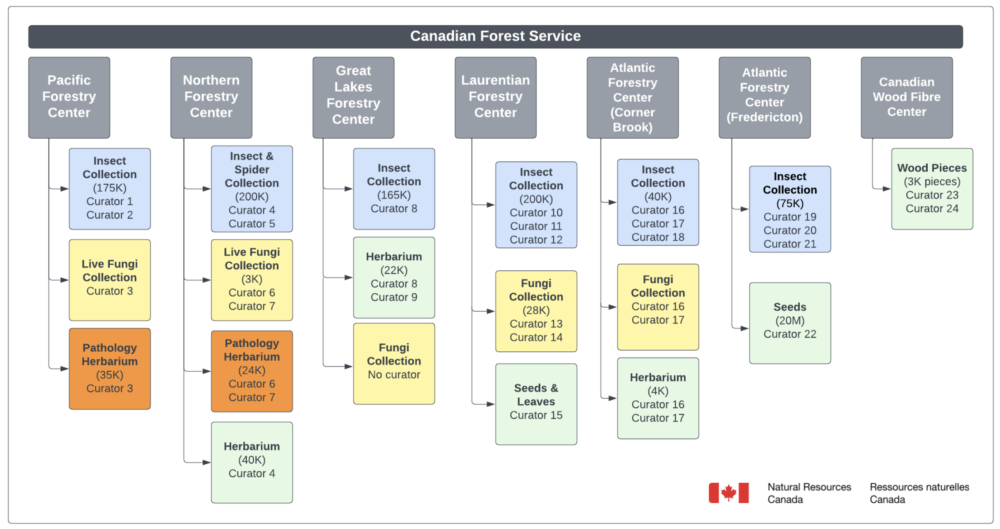

I had the fantastic opportunity to connect with collection managers and staff from the Canadian Forest Service at the CFS Collections Workshop, hosted at the Pacific Forestry Centre in the gorgeous city of Victoria, British Columbia.

It was so great to finally meet many of the workshop attendees face-to-face—putting faces to names after years of  emails and virtual meetings. The workshop, organized by the Canadian Forest Service (CFS) and the Natural Resources Canada (NRCan) Scientific Collections Project team, brought together nearly 30 participants both in person and online. The goal of the meeting was to dive into the implementation of Specify software as a national collection management tool for CFS collections.

## Exploring the Pacific Forestry Centre

The Pacific Forestry Centre is truly a hub for forest research and development, dedicated to sustainable forest management and the preservation of Canada’s diverse forest ecosystems. It was inspiring to see the passion here firsthand.
[Learn more about the Pacific Forestry Centre](https://www.nrcan.gc.ca/forests) [^1].

## Workshop Sessions: Learning and Sharing

I had the chance to lead two sessions during the workshop, focusing on the Specify software and its application in managing biological collections. The sessions were designed to be interactive and engaging, allowing participants to share their experiences and insights.

1. **Specify 101 for Curators and Collections Managers**
   We began with the basics, diving into the Specify platform through a live demo. It was amazing to see how the room lit up as everyone discovered new ways to streamline their collection management.

2. **Specify-7 In-Depth**
   Next, we dug deeper into data preparation and taxonomy. This session was all about giving everyone the tools they need to hit the ground running—whether they were new to Specify or looking to take their current practices to the next level.

After lunch, we split into groups based on the type of collection each person managed. It was a fantastic opportunity to share best practices, discuss unique challenges, and learn from one another in a truly collaborative setting.

## Highlights From the Day

### Engaging Presentations and Visuals

I opened the workshop with a brief slideshow outlining the day’s topics—setting the stage for dynamic dialogue during our Q&A segments. It was heartening to see so many eager faces participate and share their insights.

- **Organization Discussions**
  
  We reviewed the organizational hierarchies within the CFS, which provided a clearer picture of how the collections are managed. It was great to work in breakout groups to discuss the best practices for organizing collections in Specify, especially when it comes to the differences between the various disciplines.

- **Herbarium Displays**
  One of the highlights was the beautiful herbarium sheets on display at the centre. There are countless specimens in the collection, and it was great to see some of them in person. The herbarium is a treasure trove of biodiversity, showcasing the rich flora of Canada.
  

- **Insect Collection**
  I also toured their working insect collection, learning about their new DNA libraries for _Cerambycidae_. Check out the [GBIF taxonomy](https://www.gbif.org/species/5602) for further details [^2]. It was great to see both the collections space and hearing about how the data is being used by the public and researchers. The collection is a vital resource for studying the ecology and evolution of these fascinating insects.
  

The workshop was as much about learning as it was about connecting. After a busy day of sessions, we headed downtown to Swans Pub for dinner and drinks.
[Swans Pub](https://swansbrewery.com/pub/) [^3] was the perfect spot to unwind.

## A Little Adventure Outside the Workshop

My time in Victoria wasn’t solely filled with workshop sessions:

- I took a moment to explore the city by visiting the Legislative Assembly at Victoria Harbor.
- The harbor itself, with boats docked in a picturesque setting, was a lovely sight.
  
  
  
  

Before my flight, I even managed to try Tim Hortons and enjoy a delicious hot chocolate—another fantastic Canadian experience. Later, during a brief layover in Seattle, I visited Pike Place Market, saw the first Starbucks, marveled at the famous Gum Wall, and caught a glimpse of the Space Needle.
  
  
  
  
  

## In Gratitude

I'm _very_ grateful for the warm welcome I received from the CFS team. Meeting everyone, sharing my experience and advice, and collaborating to enhance the database side of biological collections management across Canada was an honor. The passion each person brought to the table was incredibly inspiring, and I can't wait to see how Specify continues to empower collections staff across Canada.

---

[^1]: Canadian Forest Service. [Pacific Forestry Centre](https://www.nrcan.gc.ca/forests): A key facility for forest research and sustainable management in Canada.
[^2]: GBIF. [Cerambycidae Taxonomy](https://www.gbif.org/species/5602): A comprehensive database covering the taxonomy of longhorn beetles.
[^3]: [Swans Pub](https://swansbrewery.com/pub/): A popular pub in Victoria, BC.